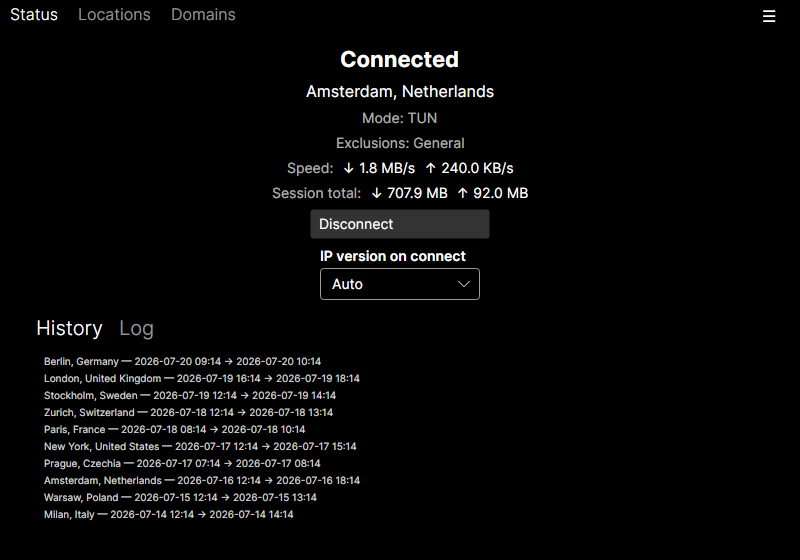
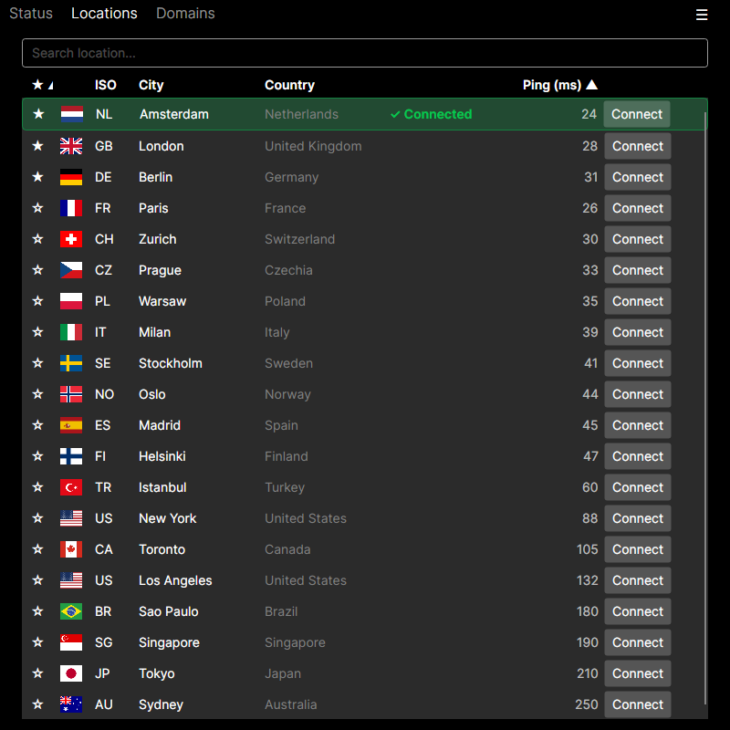
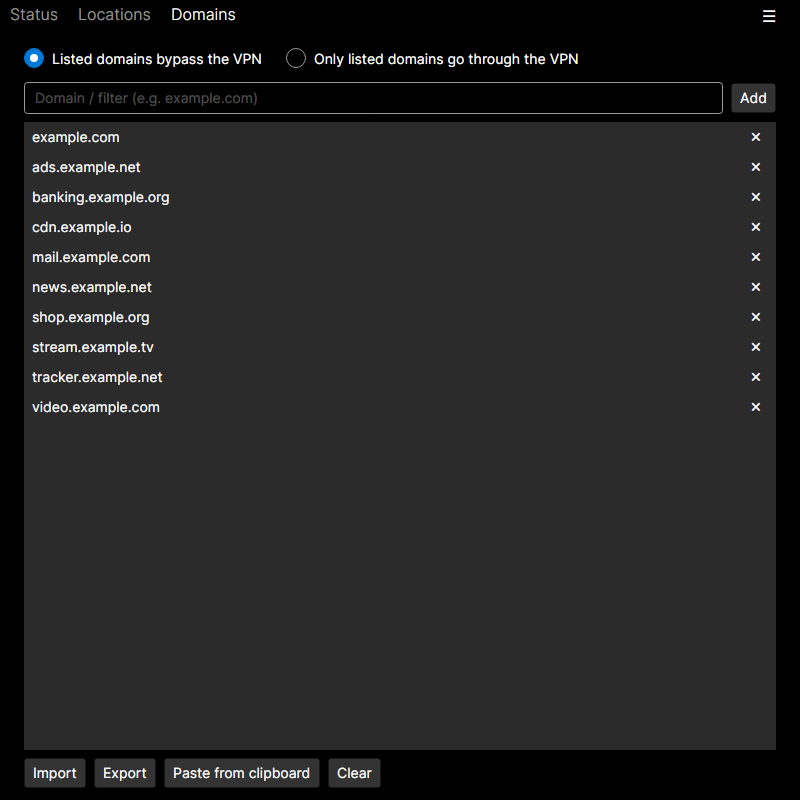
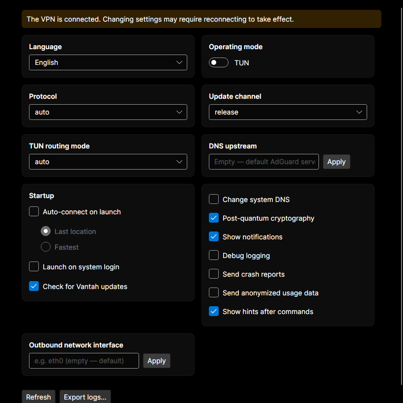

# Vantah

**English** · [Русский](README.ru.md)

Vantah is a desktop GUI client for Linux (a window plus a system-tray icon) that
acts as a convenient front-end for the official `adguardvpn-cli` command-line
tool. Vantah does **not** implement a VPN itself — it merely runs `adguardvpn-cli`
as an external process, parses its output, and shows the state in a graphical
interface.

> **Naming and legal notice.** Vantah is an independent, unofficial project. It
> is **not** affiliated with AdGuard, and is not developed, sponsored, or
> endorsed by them; it is not an AdGuard product.
>
> Vantah does **not** include, bundle, or distribute `adguardvpn-cli` or any
> other AdGuard software. You install `adguardvpn-cli` yourself; its use is
> governed by AdGuard's own license and terms, and a valid AdGuard VPN
> account/subscription is required.
>
> "AdGuard", "AdGuard VPN", and related marks are trademarks of their respective
> owners. They are used here purely nominatively — to indicate compatibility with
> `adguardvpn-cli` — and imply neither affiliation nor endorsement by the
> trademark owners. The name "Vantah" deliberately does not contain the word
> "AdGuard".

## Screenshots

| Status | Locations |
| --- | --- |
|  |  |

| Site exclusions | Settings |
| --- | --- |
|  |  |

## Requirements

- The `adguardvpn-cli` tool installed and available on your `PATH`.
- A valid AdGuard VPN account/subscription. You can sign in directly from the
  Vantah interface (device-code flow via your browser) or beforehand in a
  terminal:

  ```bash
  adguardvpn-cli login
  ```

## Features

- **Connection.** Connect / disconnect, "fastest location", IP protocol choice
  (IPv4 / IPv6). Clear progress (`Connecting…` → `Connected`).
- **Locations.** List with ping, search, and favorites.
- **Status and traffic.** Live speed and volume counters, connection history, and
  a live log tail right in the UI.
- **Site exclusions.** General / selective modes; add, remove, import, and export
  the domain list.
- **`adguardvpn-cli` settings.** TUN/SOCKS mode, SOCKS port/host/username/password,
  DNS upstream, protocol, tunnel routing mode, system DNS, post-quantum
  cryptography, notifications, telemetry and crash reporting, and more.
- **Account.** Sign in directly from the UI (device-code flow via the browser),
  license details, sign out.
- **Automation.** Autostart on login and auto-connect (fastest or last-used
  location).
- **Convenience.** System tray (window and tray share one state), UI language
  switching, CLI update checks, log export, and viewing/terminating CLI
  processes.

## Download

Ready-made builds for Linux x86-64 are published on the
[releases page](https://github.com/bolikcraft/vantah/releases/latest). No .NET
runtime is required — everything is bundled inside.

**AppImage** — download, make it executable, run:

```bash
chmod +x Vantah-*-x86_64.AppImage
./Vantah-*-x86_64.AppImage
```

**tar.gz** — unpack and run the `vantah` binary:

```bash
tar -xzf vantah-*-linux-x64.tar.gz
./vantah-*-linux-x64/vantah
```

Every asset ships with a `.sha256` file next to it; verify the download with:

```bash
sha256sum -c Vantah-*-x86_64.AppImage.sha256
```

To get an application-menu entry with an icon, build from source and run
[`packaging/install.sh`](#installing-into-the-application-menu).

## Building and running for development

Requires the **.NET 10 SDK**.

```bash
dotnet build
dotnet run --project src/Vantah.App
```

A plain `dotnet build` / `dotnet run` produces a framework-dependent build (fast,
not tied to a specific OS runtime).

## Building a single self-contained file

A self-contained, single-file binary for Linux is built with one command:

```bash
dotnet publish src/Vantah.App -c Release -r linux-x64
```

The result is a single executable (the .NET runtime and native libraries are
embedded), located here:

```
src/Vantah.App/bin/Release/net10.0/linux-x64/publish/Vantah.App
```

The binary is around 100 MB (self-contained, no trimming: Avalonia and
reflection-based XAML cannot be trimmed safely). The single-file / self-contained
flags are enabled automatically when an `-r <RID>` is provided; without a RID the
build stays a regular framework-dependent one, so day-to-day development is not
slowed down.

## Installing into the application menu

To make Vantah appear in the menu (GNOME, KDE, any other DE) with an icon and
launch on click:

```bash
packaging/install.sh
```

The script publishes the self-contained binary, places it in `~/.local/lib/vantah`
with a `~/.local/bin/vantah` symlink, installs icons into
`~/.local/share/icons/hicolor` and [`vantah.desktop`](packaging/vantah.desktop)
into `~/.local/share/applications`, then refreshes the menu and icon caches. Root
is not required. For a system-wide install use `PREFIX=/usr/local
packaging/install.sh` (as root); to uninstall, run `packaging/install.sh
--uninstall`.

## Tech stack

- C# / .NET 10 (`net10.0`).
- Avalonia 12 + FluentAvalonia (theme).
- CommunityToolkit.Mvvm (MVVM).
- xUnit — tests for the core (`Vantah.Core`).

The project is **Linux-only**. AdGuard already ships official VPN GUI clients for
Windows and macOS, so there is no point duplicating them.

## Roadmap

- IP-address and region leak detection — verifying that traffic actually goes
  through the VPN.
- Packaging and distribution: rpm/deb (AppImage and tar.gz are already published
  with every release, and there is `packaging/install.sh` plus application-menu
  integration).

## License

Vantah is distributed under the **MIT** license — full text in the
[LICENSE](LICENSE) file. In short: you may freely use, modify, and distribute the
software provided you keep the license text and copyright notice. The software is
provided "AS IS", without any warranty.

The MIT license covers **only Vantah's own code**. The `adguardvpn-cli` tool and
other AdGuard software are not covered by it and are distributed under AdGuard's
own terms.

## Disclaimer

The software is provided "AS IS", without warranty of any kind, express or
implied, including but not limited to the warranties of fitness for a particular
purpose and non-infringement. You use Vantah at your own risk; the authors and
copyright holders are not liable for any claim, damages, or other loss arising
from the use of the software.

Vantah is a networking tool that manages a VPN connection through the external
`adguardvpn-cli` utility. You are solely responsible for complying with the
applicable laws of your jurisdiction, as well as with AdGuard's license and terms
of use.
