# Vantah — Unofficial AdGuard VPN GUI for Linux

[](https://github.com/bolikcraft/vantah/actions/workflows/ci.yml)
[](https://github.com/bolikcraft/vantah/releases/latest)
[](https://github.com/bolikcraft/vantah/releases)
[](LICENSE)
[](#download)

An unofficial **`adguardvpn-cli` front-end** with a window and a system tray icon.

Vantah is a desktop GUI client for Linux (a window plus a system-tray icon) that
acts as a convenient front-end for the official `adguardvpn-cli` command-line
tool. Vantah does **not** implement a VPN itself — it merely runs `adguardvpn-cli`
as an external process, parses its output, and shows the state in a graphical
interface.

> **Naming and legal notice.** Vantah is an independent, unofficial project. It
> is **not** affiliated with AdGuard, and is not developed, sponsored, or
> endorsed by them; it is not an AdGuard product.
>
> Vantah does **not** include, bundle, or distribute `adguardvpn-cli` or any
> other AdGuard software. You install `adguardvpn-cli` yourself; its use is
> governed by AdGuard's own license and terms, and a valid AdGuard VPN
> account/subscription is required.
>
> "AdGuard", "AdGuard VPN", and related marks are trademarks of their respective
> owners. They are used here purely nominatively — to indicate compatibility with
> `adguardvpn-cli` — and imply neither affiliation nor endorsement by the
> trademark owners. The name "Vantah" deliberately does not contain the word
> "AdGuard".

## Screenshots

Buttons, toggles and other accents follow your desktop's **system accent color**
(`SystemAccentColor`), so the UI matches the rest of your system — change the accent in
your OS settings and Vantah follows. The galleries below use different accents as examples:
green in dark theme, blue in light theme.

<details open>
<summary>Dark theme (green accent)</summary>

| Status | Locations |
| --- | --- |
| 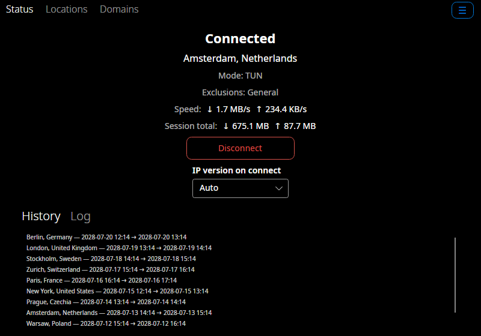 | 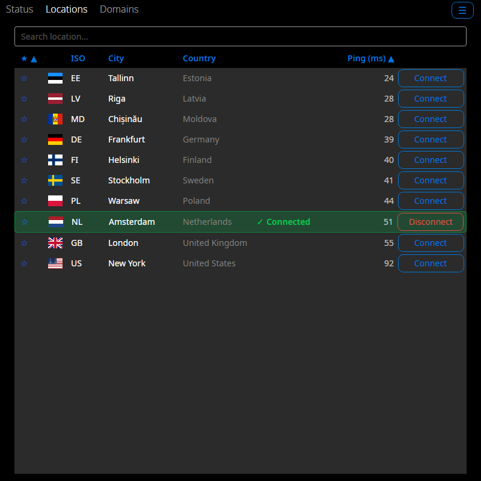 |

| Site exclusions | Account |
| --- | --- |
| 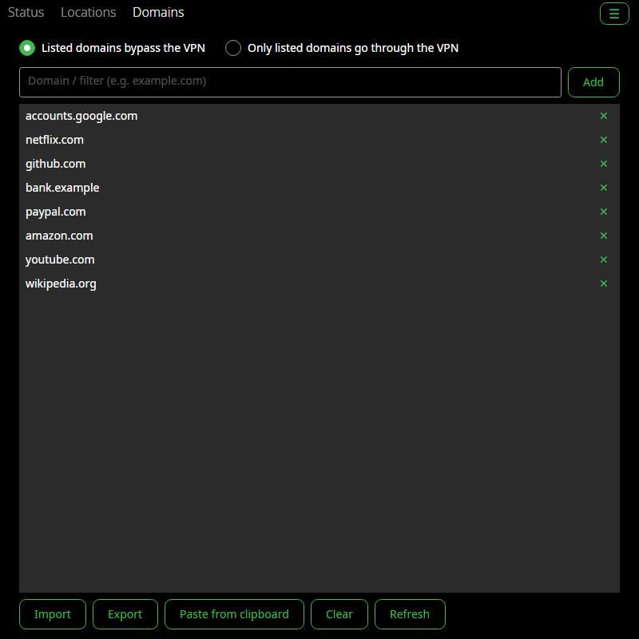 | 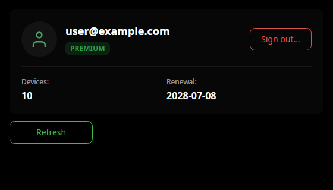 |

| Settings (TUN) | Settings (SOCKS5) |
| --- | --- |
| 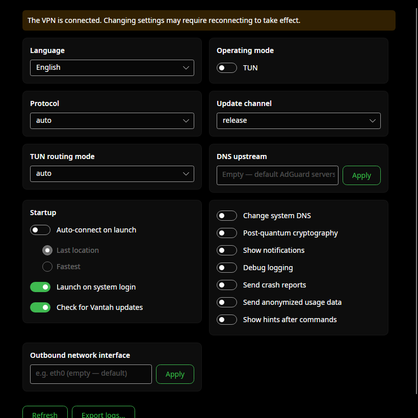 | 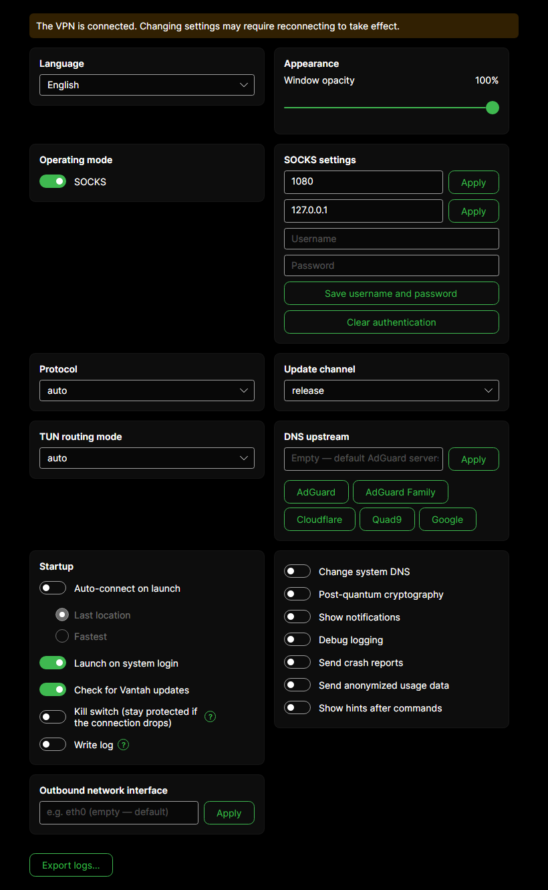 |

</details>

<details>
<summary>Light theme (blue accent)</summary>

| Status | Locations |
| --- | --- |
| 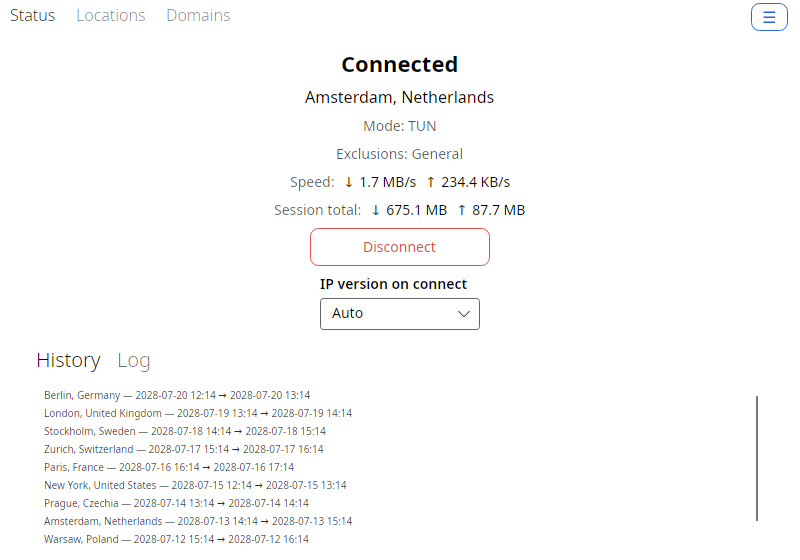 | 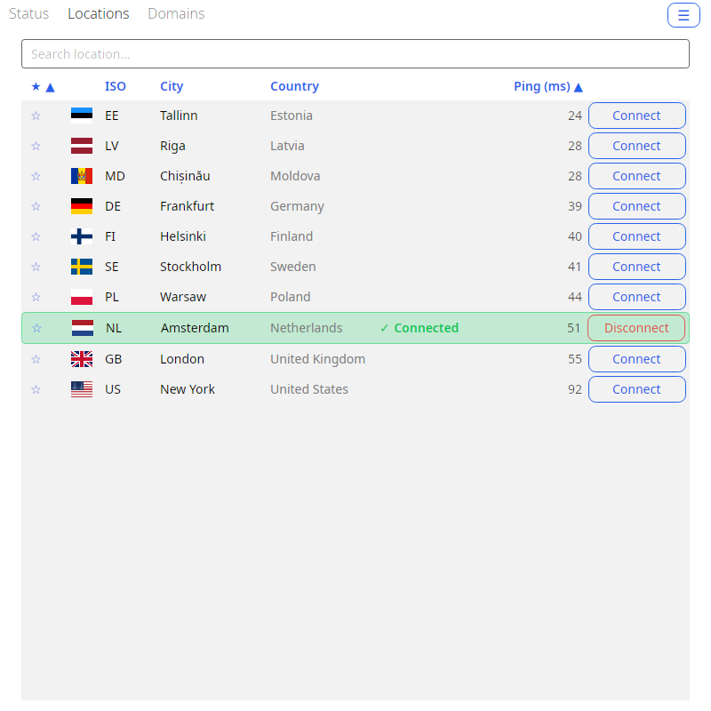 |

| Site exclusions | Account |
| --- | --- |
| 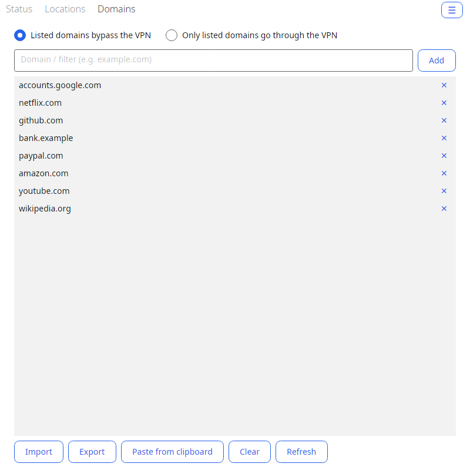 | 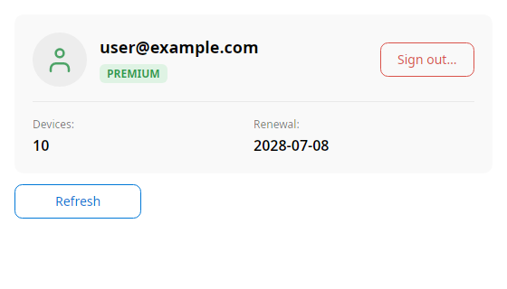 |

| Settings (TUN) | Settings (SOCKS5) |
| --- | --- |
| 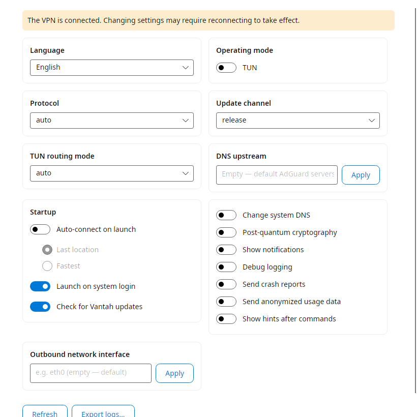 | 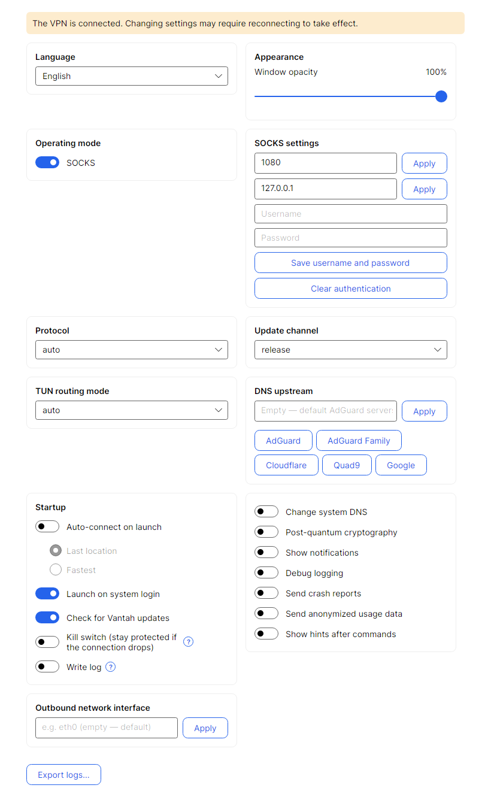 |

</details>

## Requirements

- The `adguardvpn-cli` tool installed and available on your `PATH`.
- A valid AdGuard VPN account/subscription. You can sign in directly from the
  Vantah interface (device-code flow via your browser) or beforehand in a
  terminal:

  ```bash
  adguardvpn-cli login
  ```

## Configuration and trust model

Vantah reads an optional INI file at `~/.config/vantah/vantah.conf` (you create it
yourself; without it the defaults apply):

```ini
# Which binary to run as the CLI: a name looked up in PATH or an absolute path.
adguard_cmd = adguardvpn-cli

# Optional command used to force-terminate a CLI process; the PID is appended as
# the last argument. Without this key Vantah signals the process itself via kill(2).
# The template is split on spaces — quoting and paths with spaces are not supported.
kill_cmd = pkexec kill
```

The same two values can be supplied through the `VANTAH_ADGUARD_CMD` and
`VANTAH_KILL_CMD` environment variables; if a key is set in both places, the
config file wins.

Both values are executed as given — Vantah does not validate, restrict, or
sandbox them, and the usual `kill_cmd` runs through `pkexec`, that is **with
elevated privileges**. The config file is therefore a trust boundary: anyone able
to write to it can make Vantah run an arbitrary command on your behalf. Keep
`~/.config/vantah` owned by your user and not writable by anyone else — Vantah
creates that directory with `0700` permissions (and tightens an existing one)
when it writes its own files there.

## Features

- **Connection.** Connect / disconnect, "fastest location", IP protocol choice
  (IPv4 / IPv6). Clear progress (`Connecting…` → `Connected`).
- **Locations.** List with ping, search, and favorites.
- **Status and traffic.** Live speed and volume counters, connection history, and
  a live log tail right in the UI.
- **Site exclusions.** General / selective modes; add, remove, import, and export
  the domain list.
- **`adguardvpn-cli` settings.** TUN/SOCKS mode, SOCKS port/host/username/password,
  DNS upstream, protocol, tunnel routing mode, system DNS, post-quantum
  cryptography, notifications, telemetry and crash reporting, and more.
- **Account.** Sign in directly from the UI (device-code flow via the browser),
  license details, sign out.
- **Automation.** Autostart on login and auto-connect (fastest or last-used
  location).
- **Convenience.** System tray (window and tray share one state), UI language
  switching, CLI update checks, log export, and viewing/terminating CLI
  processes.

## Interface languages

Vantah speaks English, Russian, German, Spanish, French, Indonesian, Italian,
Polish, Brazilian Portuguese, Turkish, Ukrainian and Simplified Chinese. On
first launch it follows the system locale and falls back to English when that
locale is not among the supported ones; the language is also picked in Settings
and applies immediately.

Only the English and Russian strings are written by the authors. **Every other
language is a draft that has not been reviewed by a native speaker** — if
something reads wrong, an issue or a pull request against
`src/Vantah.App/Localization/Strings.<code>.resx` is very welcome.

## Download

Ready-made builds for Linux x86-64 are published on the
[releases page](https://github.com/bolikcraft/vantah/releases/latest). No .NET
runtime is required — everything is bundled inside.

**AppImage** — download, make it executable, run:

```bash
chmod +x Vantah-*-x86_64.AppImage
./Vantah-*-x86_64.AppImage
```

**tar.gz** — unpack and run the `vantah` binary:

```bash
tar -xzf vantah-*-linux-x64.tar.gz
./vantah-*-linux-x64/vantah
```

**.deb** (Debian, Ubuntu, and derivatives) — install with your package manager;
the application-menu entry with an icon appears right after installation:

```bash
sudo apt install ./vantah_*.deb
```

**.rpm** (Fedora, RHEL, openSUSE, and derivatives) — same, via dnf:

```bash
sudo dnf install ./vantah-*.rpm
```

Both packages install the binary to `/usr/lib/vantah` (with a `/usr/bin/vantah`
symlink) and register the menu entry and icons automatically. They do **not**
pull in `adguardvpn-cli` (it is not in distro repositories) — install it
yourself, see [Requirements](#requirements).

## Install from a repository (with automatic updates)

The same packages are built in the [openSUSE Build
Service](https://build.opensuse.org/project/show/home:bolikcraft), so
Vantah is updated by your usual `dnf upgrade` / `zypper up` / `apt upgrade`
instead of downloading a file every time. Available for x86-64.

**Fedora 43 / 44:**

```bash
sudo dnf config-manager addrepo --from-repofile=https://download.opensuse.org/repositories/home:bolikcraft/Fedora_$(rpm -E %fedora)/home:bolikcraft.repo
sudo dnf install vantah
```

**openSUSE Tumbleweed** (for Leap 16.0 replace `openSUSE_Tumbleweed` with `openSUSE_Leap_16.0`):

```bash
sudo zypper addrepo https://download.opensuse.org/repositories/home:bolikcraft/openSUSE_Tumbleweed/home:bolikcraft.repo
sudo zypper --gpg-auto-import-keys refresh
sudo zypper install vantah
```

**Debian 13** (for Ubuntu use `xUbuntu_24.04` or `xUbuntu_26.04` instead of `Debian_13`):

```bash
echo 'deb http://download.opensuse.org/repositories/home:/bolikcraft/Debian_13/ /' \
  | sudo tee /etc/apt/sources.list.d/home:bolikcraft.list
curl -fsSL https://download.opensuse.org/repositories/home:bolikcraft/Debian_13/Release.key \
  | gpg --dearmor | sudo tee /etc/apt/trusted.gpg.d/home_bolikcraft.gpg > /dev/null
sudo apt update
sudo apt install vantah
```

**Arch Linux** — the package lives in the AUR as
[`vantah-bin`](https://aur.archlinux.org/packages/vantah-bin):

```bash
yay -S vantah-bin
```

Every asset ships with a `.sha256` file next to it; verify the download with:

```bash
sha256sum -c Vantah-*-x86_64.AppImage.sha256
```

To get an application-menu entry with an icon, build from source and run
[`packaging/install.sh`](#installing-into-the-application-menu).

## Building and running for development

Requires the **.NET 10 SDK**.

```bash
dotnet build
dotnet run --project src/Vantah.App
```

A plain `dotnet build` / `dotnet run` produces a framework-dependent build (fast,
not tied to a specific OS runtime).

## Building a single self-contained file

A self-contained, single-file binary for Linux is built with one command:

```bash
dotnet publish src/Vantah.App -c Release -r linux-x64
```

The result is a single executable (the .NET runtime and native libraries are
embedded), located here:

```
src/Vantah.App/bin/Release/net10.0/linux-x64/publish/Vantah.App
```

The binary is around 100 MB (self-contained, no trimming: Avalonia and
reflection-based XAML cannot be trimmed safely). The single-file / self-contained
flags are enabled automatically when an `-r <RID>` is provided; without a RID the
build stays a regular framework-dependent one, so day-to-day development is not
slowed down.

## Installing into the application menu

To make Vantah appear in the menu (GNOME, KDE, any other DE) with an icon and
launch on click:

```bash
packaging/install.sh
```

The script publishes the self-contained binary, places it in `~/.local/lib/vantah`
with a `~/.local/bin/vantah` symlink, installs icons into
`~/.local/share/icons/hicolor` and [`vantah.desktop`](packaging/vantah.desktop)
into `~/.local/share/applications`, then refreshes the menu and icon caches. Root
is not required. For a system-wide install use `PREFIX=/usr/local
packaging/install.sh` (as root); to uninstall, run `packaging/install.sh
--uninstall`.

## Tech stack

- C# / .NET 10 (`net10.0`).
- Avalonia 12 + FluentAvalonia (theme).
- CommunityToolkit.Mvvm (MVVM).
- xUnit — tests for the core (`Vantah.Core`) and for the UI (`Vantah.App`,
  headless Avalonia).

The project is **Linux-only**. AdGuard already ships official VPN GUI clients for
Windows and macOS, so there is no point duplicating them.

## Roadmap

- IP-address and region leak detection — verifying that traffic actually goes
  through the VPN.

## FAQ

**Is there an official AdGuard VPN GUI for Linux?**
No. AdGuard ships official VPN GUI clients for Windows and macOS, while the
Linux client is the `adguardvpn-cli` command-line tool. Vantah is an independent,
unofficial third-party front-end for that CLI and is not an AdGuard product.

**Does Vantah work without an AdGuard VPN account or subscription?**
No. Vantah only drives `adguardvpn-cli`, so you need the CLI installed and a
valid AdGuard VPN account/subscription. You can sign in from the Vantah UI via
the device-code flow — see [Requirements](#requirements).

**Which Linux distributions are supported?**
The AppImage and the tar.gz archive run on any x86-64 distribution (the .NET
runtime is bundled); the `.deb` targets Debian, Ubuntu and derivatives, and the
`.rpm` targets Fedora, RHEL, openSUSE and derivatives. Only x86-64 builds are
published — see [Download](#download).

**Does Vantah need root?**
Day-to-day use does not, and `packaging/install.sh` installs into your home
directory without root. Root is involved only where your system requires it:
installing the `.deb`/`.rpm` packages, and the optional `kill_cmd = pkexec kill`
used to force-terminate a CLI process — see
[Configuration and trust model](#configuration-and-trust-model).

**Do I need to install the .NET runtime?**
No. The published AppImage, tar.gz, `.deb` and `.rpm` builds are self-contained —
the runtime is embedded. The .NET 10 SDK is needed only to build from source,
see [Building and running for development](#building-and-running-for-development).

**Does Vantah send anything over the network on its own?**
Only an update check against this repository's GitHub releases page, which can be
switched off in Settings. Vantah has no telemetry of its own; everything else
(traffic, account, telemetry options) belongs to `adguardvpn-cli`, whose settings
Vantah merely exposes.

## License

Copyright (C) 2026 bolikcraft

Vantah is free software distributed under the **GNU General Public License,
version 3 or (at your option) any later version** — full text in the
[LICENSE](LICENSE) file. In short: you may freely use, modify, and distribute the
software, but any distributed derivative work must also be released under the
GPL with its source code available. The software is provided "AS IS", without
any warranty.

The GPL covers **only Vantah's own code**. The `adguardvpn-cli` tool and other
AdGuard software are not covered by it, are not bundled with Vantah, and are
distributed under AdGuard's own terms. Vantah invokes `adguardvpn-cli` as a
separate process and does not link against it.

## Disclaimer

The software is provided "AS IS", without warranty of any kind, express or
implied, including but not limited to the warranties of fitness for a particular
purpose and non-infringement. You use Vantah at your own risk; the authors and
copyright holders are not liable for any claim, damages, or other loss arising
from the use of the software.

Vantah is a networking tool that manages a VPN connection through the external
`adguardvpn-cli` utility. You are solely responsible for complying with the
applicable laws of your jurisdiction, as well as with AdGuard's license and terms
of use.
